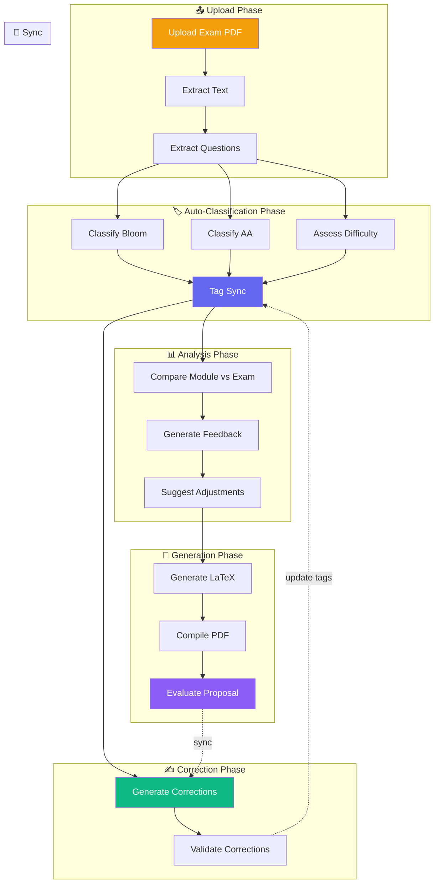
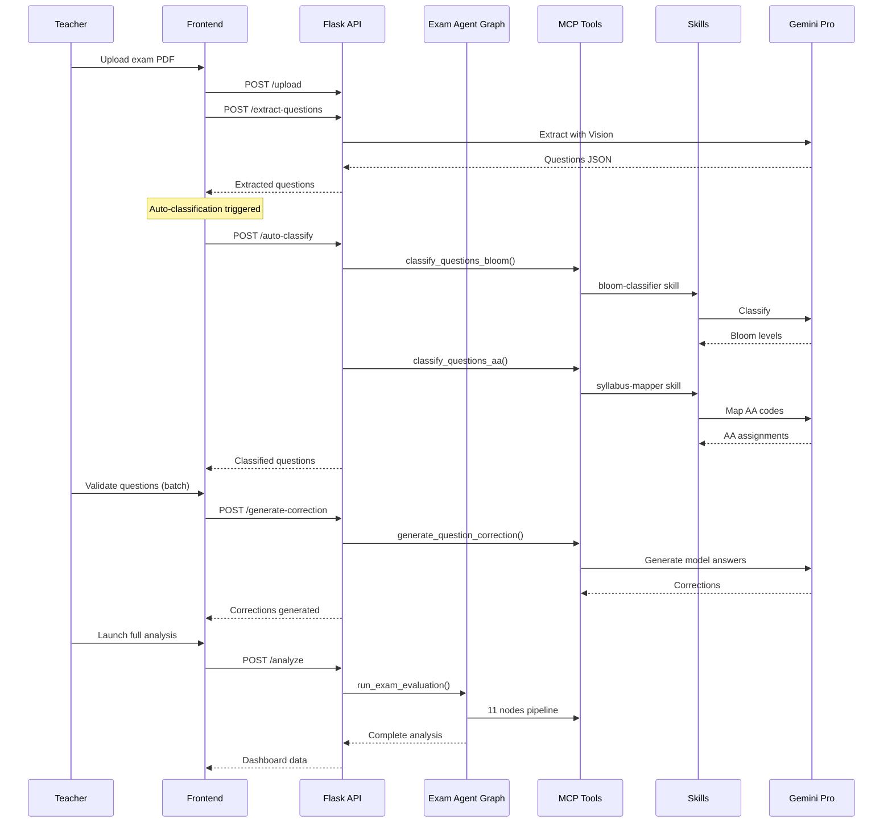

# Exam Preparation — Agent & Skills Flow

## Complete Pipeline

## Agent Nodes & Skills Used

| Node | Agent Type | LLM Model | Skills Used |
|------|-----------|-----------|-------------|
| Extract Text | Deterministic | — | — |
| Extract Questions | Deterministic | gemini-2.5-pro | — |
| Classify Bloom | ReAct Agent | gemini-2.5-pro | bloom-classifier |
| Classify AA | ReAct Agent | gemini-2.5-pro | syllabus-mapper |
| Assess Difficulty | Deterministic | gemini-2.5-pro | — |
| Compare Module vs Exam | Deterministic | gemini-2.5-pro | — |
| Generate Feedback | ReAct Agent | gemini-2.5-pro | feedback-writer |
| Suggest Adjustments | ReAct Agent | gemini-2.5-pro | — |
| Generate Corrections | ReAct Agent | gemini-2.5-pro | rubric-builder |
| Generate LaTeX | Deterministic | gemini-2.5-pro | — |
| Evaluate Proposal | Deterministic | gemini-2.5-pro | — |
| Tag Sync | MCP Tool | gemini-2.5-pro | bloom-classifier, syllabus-mapper |
| Correct Student | MCP Tool | gemini-2.5-pro | feedback-writer |

## Interaction Diagram

